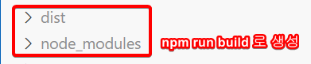
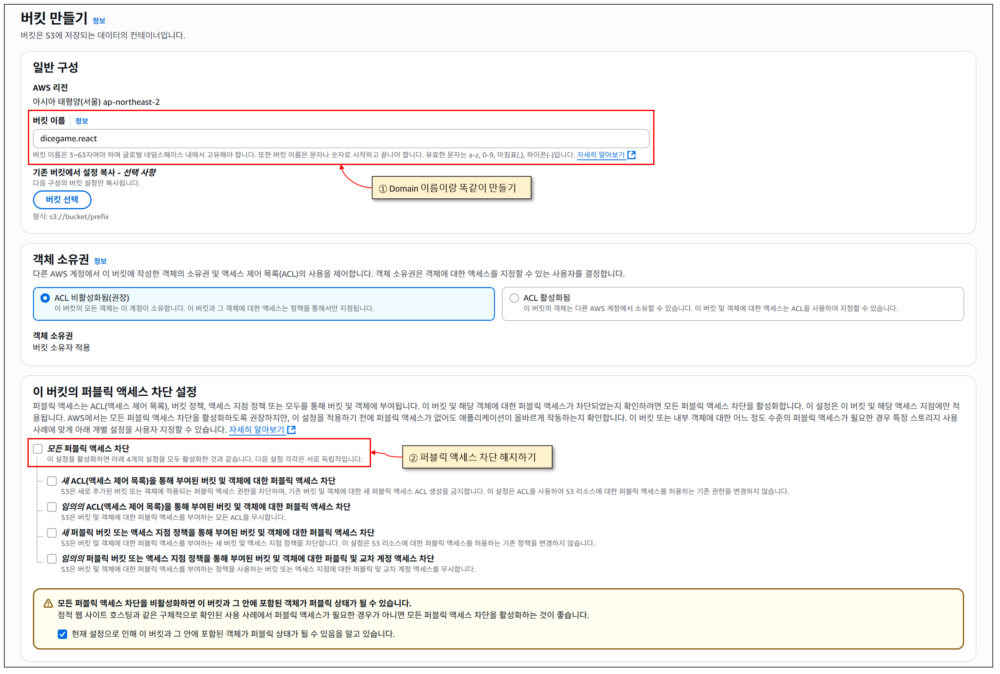
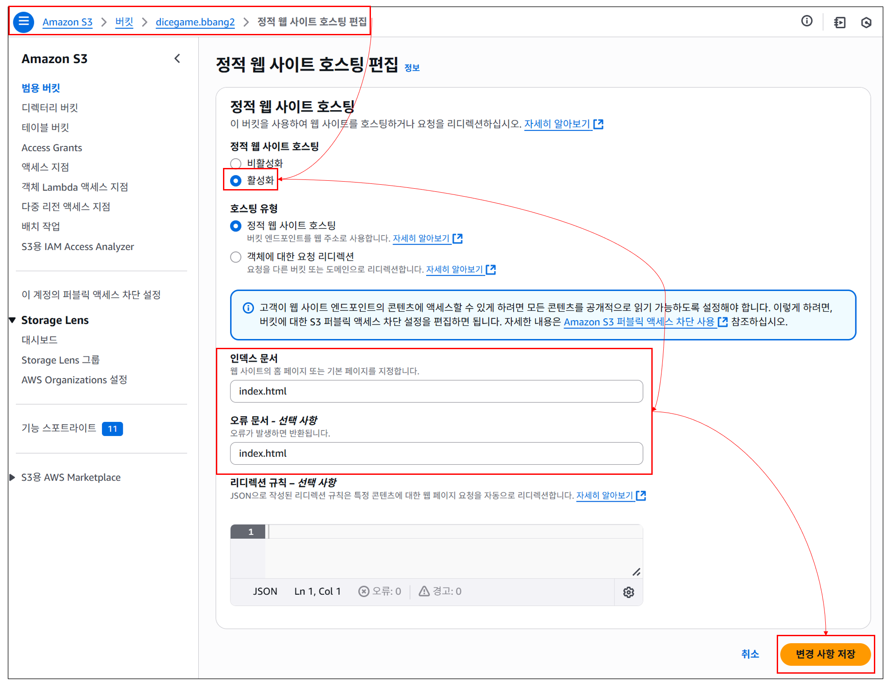
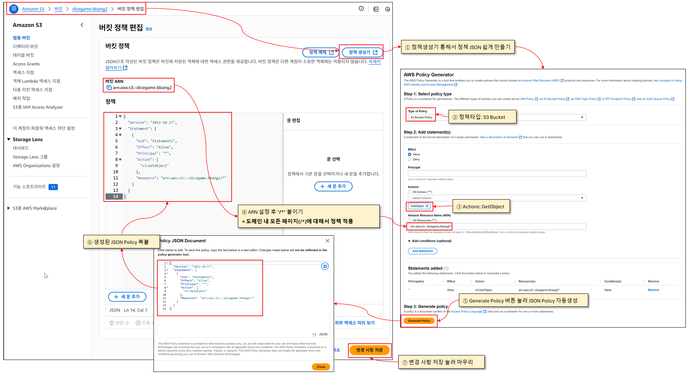
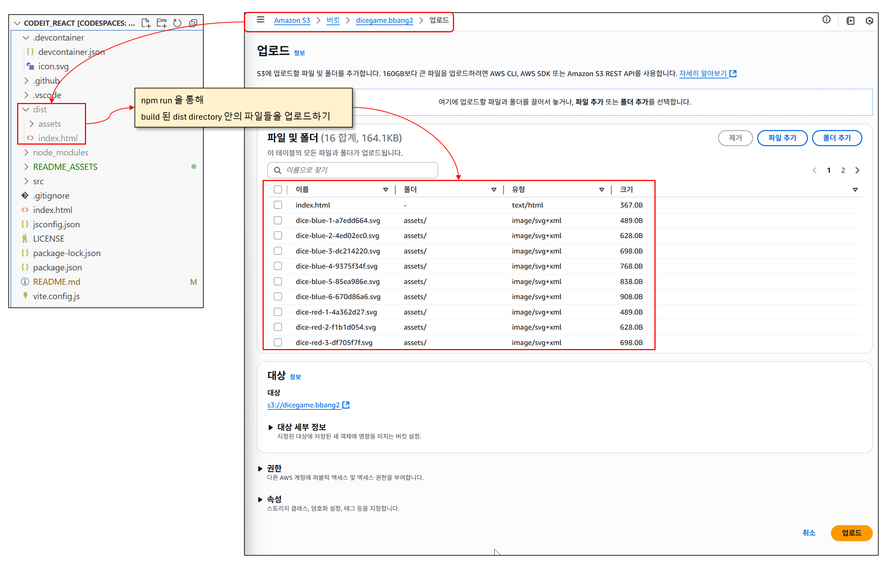

## 배포방법 정리

### 1. local test

#### ① 프로젝트빌드
웹 브라우저가 읽을 수 있는 형태로 리액트 프로젝트를 html js css로 빌드함

```bash
npm run build
```



#### ② 빌드된 프로젝트 로컬에서 실행

```bash
npx serve build -s dist 
# vite로 만든 react프로젝트의 경우 dist 디렉토리에 정적파일들 생김
# -s: SPA모드 (SPA = Single Page Application), SPA 모드인 경우에는 어떤 경로든 무조건 index.html을 반환
```

### 2. 배포

#### ① 버킷만들기



#### ② 정적 웹 사이트 호스팅 편집


#### ③ 버킷 정책 편집


> <strong> 버킷정책의미 </strong> </br>
> ```JSON
> {
>   "Version": "2012-10-17",
>   "Statement": [
>     {
>       "Sid": "Statement1",                    // > 정책 식별자 (임의의 이름)
>       "Effect": "Allow",                      // 허용(Allow)할지 거부(Deny)할지
>       "Principal": "*",                       // 모든 사용자(익명 포함)
>       "Action": "s3:GetObject",               // 객체 다운로드 권한
>       "Resource": "arn:aws:s3:::dicegame.bbang2/*" // 이 버킷의 모든 파일
>     }
>   ]
> }
> 
> ```
#### ④ 소스코드 업로드
